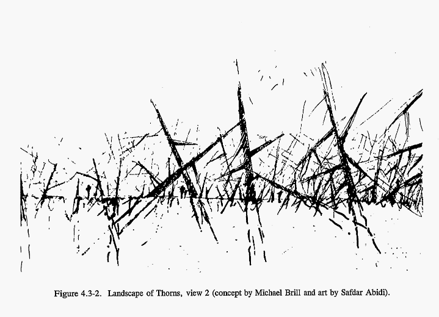

# ❄️ Nix Configs ❄️



## Usage

To run:

```sh
make switch
```

The `Makefile` has logic to know if it is running on macOS or NixOS and targets `$(hostname -s)`.

## Docs

* [Home configuration](./docs/home.md)
* [Darwin configuration](./docs/darwin.md)

## Links

* [MyNixOS](https://mynixos.com/)

### Blogs

* [Nixcademy Posts](https://nixcademy.com/posts)
* [Setting up my new laptop: nix style](https://bmcgee.ie/posts/2022/12/setting-up-my-new-laptop-nix-style/)
* [A minimal nix-shell](https://fzakaria.com/2021/08/02/a-minimal-nix-shell.html)
* [Some notes on using nix](https://jvns.ca/blog/2023/02/28/some-notes-on-using-nix/)
* [Flakes: NixOS and Home Manager migration](https://gvolpe.com/blog/nix-flakes/)